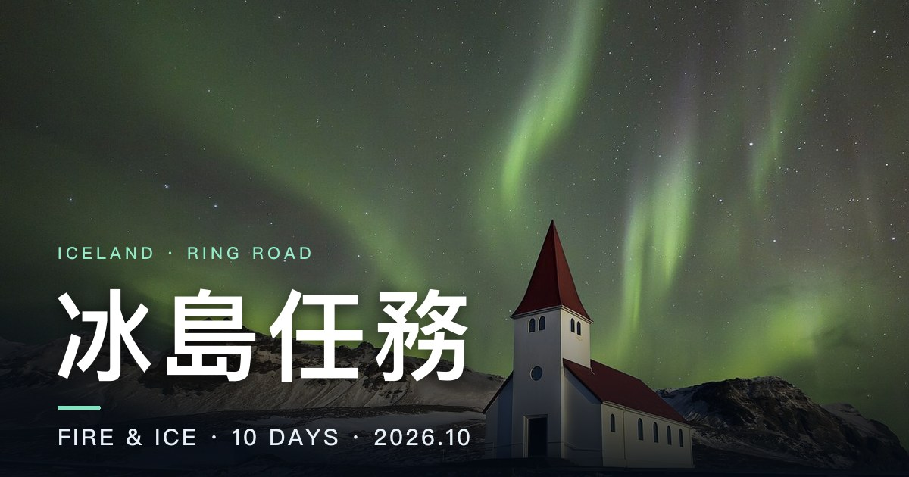

# 冰島任務 · Fire & Ice

> 10 天冰島環島的沉浸式行程網頁 —— 2026.10，一號公路一圈 1,800 公里，瀑布、冰洞、黑沙灘、極光，全部塞進一個可以滑、可以玩的網站。



這是一個**純靜態網站**（HTML + CSS + JavaScript，不用 build、不用 npm），丟上 GitHub Pages 就能分享給一起出發的旅伴。

---

## 目錄

- [功能特色](#功能特色)
- [資料夾結構](#資料夾結構)
- [如何修改行程](#如何修改行程)
- [本機預覽](#本機預覽)
- [課堂展示小撇步](#課堂展示小撇步)
- [部署到 GitHub Pages](#部署到-github-pages)
- [3D 虛擬空間操作說明](#3d-虛擬空間操作說明)
- [照片來源](#照片來源)
- [使用技術](#使用技術)

---

## 功能特色

| | 功能 | 說明 |
|---|---|---|
| 🍎 | **Apple 風格滾動敘事首頁** | 一路往下滑，標題、數字、地圖跟著捲動節奏淡入、放大、釘住，像在看產品發表會 |
| 🗓️ | **每日行程** | 每天一個章節：日期、主題色、日落時間、住宿，加上每個景點的時間、介紹與 Google Maps 連結 |
| ✨ | **景點照片動態特效** | 每張照片都疊了一層 Canvas 小動畫：瀑布水流、間歇泉噴發、極光飄動、溫泉蒸氣、海浪、浮冰…… |
| 🧍 | **5 個 3D 虛擬空間** | 每個空間都有一個可以操控的小人物，能走、能跑、能跳 |

### 5 個 3D 虛擬空間

| 空間 | 檔案 | 景點 |
|---|---|---|
| ♨️ 藍湖溫泉 | [`worlds/blue-lagoon.html`](worlds/blue-lagoon.html) | Blue Lagoon · Bláa lónið |
| 🌊 黑沙灘 | [`worlds/reynisfjara.html`](worlds/reynisfjara.html) | Reynisfjara 玄武岩柱 |
| 🧊 冰河湖 | [`worlds/jokulsarlon.html`](worlds/jokulsarlon.html) | Jökulsárlón Glacier Lagoon |
| 💎 藍冰洞 | [`worlds/ice-cave.html`](worlds/ice-cave.html) | Crystal Ice Cave · Breiðamerkurjökull |
| ⛰️ 草帽山 | [`worlds/kirkjufell.html`](worlds/kirkjufell.html) | Kirkjufell 教會山 |

---

## 資料夾結構

```
iceland-trip/
├── index.html            # 首頁（滾動敘事 + 每日行程，內容全部由 data/ 產生）
├── css/main.css          # 首頁樣式
├── js/
│   ├── main.js           # 首頁：渲染行程、地圖、捲動動畫
│   ├── fx.js             # 景點照片上的 Canvas 小動畫（window.FX）
│   ├── intro.js          # 電影式開場（飛機窗 → 穿過雲層）
│   ├── drive.js          # 每天之間的「開車過場」
│   ├── viewer.js         # 點照片「走進風景」全螢幕檢視器
│   ├── ambient.js        # 即時合成的環境音（右下角按鈕開關）
│   └── cinema.js         # 底片顆粒、暗角、游標等電影感效果
├── worlds/
│   ├── engine.js         # 3D 引擎（three.js r160，ES module）
│   ├── world.css         # 3D 頁面的 HUD 樣式
│   ├── _template.html    # 新增 3D 空間時複製這個範本
│   └── <id>.html         # 5 個 3D 虛擬空間
├── data/
│   ├── itinerary.js      # ★ 行程資料 —— 要改行程只改這個
│   ├── route.js          # 每天的行車路線、冰島輪廓（地圖用）
│   ├── credits.js        # 照片作者與授權（網頁讀這個）
│   └── credits.json      # 同一份資料的 JSON 版（備查）
├── assets/
│   ├── img/              # 景點照片，檔名 = 景點 id
│   └── og.jpg            # 分享到 LINE / FB 時的預覽圖（1200×630）
├── *-test.html           # 各模組的獨立測試頁（展示用不到）
├── bump.py               # 更新 index.html 裡 js/css 的 ?v= 版本號（避免快取）
├── deploy.sh             # 一鍵部署到 GitHub Pages
├── .nojekyll             # 告訴 GitHub Pages 不要跑 Jekyll
└── README.md
```

---

## 如何修改行程

> **只要改 `data/itinerary.js` 一個檔案就好**，其他程式碼都不用動。存檔後重新整理網頁就會看到變化
> （導覽列的日期、每日章節、地圖說明、3D 卡片、照片來源都會自動跟著更新）。
>
> 💡 如果重新整理後還是舊內容，是瀏覽器快取：按 **⌘ + Shift + R**（Windows：**Ctrl + Shift + R**）強制重新載入。

`itinerary.js` 裡面是 `window.TRIP` 物件，`days` 是每一天，每一天底下的 `spots` 是當天的景點。
最上面還有幾個全站欄位：

| 欄位 | 說明 |
|---|---|
| `title` / `subtitle` / `dates` | 首頁大標、副標、日期 |
| `stats` | 「旅程數字」區塊，例如 `{ value: '1,800', unit: 'km', label: '環島一號公路' }`，數字會自動跳動 |
| `myMap` | 頁尾「開啟 Google 我的地圖」按鈕的連結 |
| `worlds` | 3D 虛擬空間卡片清單（見下方） |

> 存檔前可以先在終端機跑 `node --check data/itinerary.js`，少一個逗號或引號它會告訴你在第幾行。

### 每一天（day）

| 欄位 | 說明 | 範例 |
|---|---|---|
| `id` | 這一天的代號 | `'d1'` |
| `date` / `weekday` | 日期、星期 | `'10/4'` / `'五'` |
| `title` / `subtitle` | 當天標題、副標 | `'金圈'` / `'大陸裂谷 · 間歇泉 · 黃金瀑布'` |
| `accent` | 當天主題色 | `'#f5c45e'` |
| `sun` | 日出／日落（選填） | `{ set: '18:36' }` |
| `stay` | 住宿（選填） | `{ name: '...', map: 'https://...' }` |
| `spots` | 當天景點陣列 | 見下表 |

### 每個景點（spot）

| 欄位 | 必填 | 說明 |
|---|:---:|---|
| `id` | ✅ | 唯一代號（英文小寫、用 `-` 連接）。**照片會自動讀 `assets/img/<id>.jpg`** |
| `time` | ✅ | 時間，例如 `'16:40'` |
| `title` | ✅ | 中文名稱，例如 `'藍湖溫泉'` |
| `en` | ✅ | 英文／冰島文名稱，例如 `'Blue Lagoon · Bláa lónið'` |
| `desc` | ✅ | 一兩句介紹，會直接顯示在網頁上 |
| `fx` | ✅ | 照片上的動態特效，見下方清單 |
| `world` | | 有 3D 虛擬空間的話，填 `worlds/` 底下的檔名（**不含** `.html`），例如 `'blue-lagoon'` |
| `tags` | | 標籤，例如 `['必去']`、`['備案']`、`['美食']`、`['世界遺產']` |
| `map` | | Google Maps 連結 |
| `lat` / `lng` | | 緯度／經度，用來在地圖上畫點，例如 `lat: 63.8802, lng: -22.4516` |
| `note` | | 小提醒，例如 `'先去小豬超市 Bónus 補給'` |

#### 範例

```js
{ id: 'blue-lagoon', time: '16:40', title: '藍湖溫泉', en: 'Blue Lagoon · Bláa lónið',
  fx: 'steam', world: 'blue-lagoon', tags: ['必去'],
  lat: 63.8802, lng: -22.4516, map: 'https://maps.app.goo.gl/WGZGaAk7Cv4PdEKfA',
  desc: '黑色熔岩田中央，一池牛奶藍的溫泉冒著白煙。',
  note: '記得帶毛巾' },
```

### 換照片

把照片放到 `assets/img/`，檔名取成景點的 `id`，例如 `id: 'gullfoss'` → `assets/img/gullfoss.jpg`。

- 建議橫式、寬度約 1600px、檔案 500 KB 以內，手機載入比較快
- 如果用的是別人的照片，記得在 `data/credits.js` 補上作者與授權（頁尾的照片來源清單就是讀這個檔；`credits.json` 是同一份資料的備份，一起改最好）：
  ```js
  "gullfoss": { "title": "File:xxx.jpg", "page": "https://commons.wikimedia.org/wiki/File:xxx.jpg", "artist": "作者", "license": "CC BY-SA 4.0" },
  ```
- 換了照片之後，`js/fx.js` 會自動偵測照片已經不同，特效改用通用位置（不會錯位）

### 3D 虛擬空間卡片（`worlds`）

`TRIP.worlds` 決定首頁「走進冰島 · 3D 虛擬空間」區塊要列出哪些卡片：

```js
worlds: [
  { id: 'blue-lagoon', title: '藍湖溫泉', en: 'Blue Lagoon', img: 'blue-lagoon', desc: '在乳藍色溫泉裡漫步，蒸汽從身邊升起。' },
],
```

- `id` = `worlds/<id>.html` 的檔名；`img` = 卡片背景照片 `assets/img/.jpg`
- 景點的 `world` 欄位填同一個 `id`，那張景點卡片就會多一顆「進入 3D 虛擬空間」按鈕
- 想做新的 3D 空間：複製 `worlds/_template.html` 改名，再把它加進這個清單

### `fx` 特效清單

| `fx` | 效果 | 適合 |
|---|---|---|
| `waterfall` | 瀑布水流 | 黃金瀑布、斯科加瀑布 |
| `geyser` | 間歇泉噴發 | 史托克間歇泉 |
| `aurora` | 極光飄動 | 草帽山、夜景 |
| `steam` | 溫泉蒸氣 | 藍湖、地熱區、熱湯 |
| `waves` | 海浪 | 黑沙灘、海岸 |
| `drift` | 浮冰漂移 | 冰河湖 |
| `ice` | 冰晶閃光 | 冰洞、冰川 |
| `snow` | 飄雪 | 高地、山區 |
| `mist` | 霧氣 | 峽谷、清晨 |
| `ripple` | 水面波紋 | 湖泊、運河 |
| `city` | 城市燈光 | 雷克雅維克、教堂 |
| `sunset` | 夕陽光暈 | 傍晚景點 |
| `drive` | 公路行駛 | 取車、長途移動 |
| `flight` | 飛行 | 機場、轉機 |
| `wind` | 風吹草動 | 國家公園、曠野 |

---

## 本機預覽

```bash
cd iceland-trip
python3 -m http.server 8000
```

然後用瀏覽器打開 👉 **http://localhost:8000**

> ⚠️ **一定要用 server 開，不能直接雙擊 html 檔。**
> 3D 頁面使用 ES modules（`<script type="module">`），瀏覽器基於安全限制，用 `file://` 開啟會整片空白。
> 另外 GSAP、Lenis、three.js 是從 CDN 載入的，**需要連網**。

停止 server：在終端機按 `Ctrl + C`。

---

## 課堂展示小撇步

| 想要 | 做法 |
|---|---|
| 跳過電影式開場 | 網址加上 `?intro=0`，例如 `http://localhost:8000/?intro=0` |
| 再看一次開場 | 網址加上 `?intro=1`（同一個分頁看過一次後預設就不會再播） |
| 直接跳到某一天 | 點上方導覽列的日期，或網址加 `#day-d3`（`d3` = 那天的 `id`） |
| 直接跳到 3D 區塊 | 點右上角「3D 體驗」，或網址加 `#worlds` |
| 看照片大圖 | 點任一張景點照片，進入「走進風景」全螢幕檢視器（← → 切換、Esc 關閉） |
| 開／關環境音 | 右下角的聲音按鈕（瀏覽器規定要點一下才會出聲） |

頁面很長（每天之間還有開車過場），展示時用導覽列的日期跳轉最快。
投影前建議先把網頁和一個 3D 空間各開一次，讓瀏覽器把照片與 three.js 快取起來。

---

## 部署到 GitHub Pages

### 方法一：一行指令（推薦）

需要先安裝並登入 [GitHub CLI](https://cli.github.com/)：

```bash
brew install gh      # 沒裝過的話
gh auth login        # 登入一次就好
```

接著在 `iceland-trip` 資料夾裡執行：

```bash
./deploy.sh                 # repo 名稱預設 iceland-trip
./deploy.sh my-iceland      # 或自訂 repo 名稱
```

腳本會自動：更新快取版本號（`bump.py`）→ `git init` → `commit` → 建立公開 repo 並 push → 開啟 GitHub Pages → 印出網址。
之後**修改行程再跑一次 `./deploy.sh`** 就會更新網站。

> 💡 `index.html` 引用的檔案都帶著 `?v=版本號`（例如 `data/itinerary.js?v=10041652`）。
> 改完行程如果是手動 commit，先跑一次 `python3 bump.py` 換新版本號，朋友的瀏覽器才不會繼續用快取裡的舊行程。

不想用腳本的話，等價的 gh 指令是：

```bash
git init -b main && git add -A && git commit -m "冰島任務" \
  && gh repo create iceland-trip --public --source=. --push \
  && gh api -X POST "repos/{owner}/iceland-trip/pages" -f "source[branch]=main" -f "source[path]=/"
```

### 方法二：一步一步來

1. **建立 git repo 並 commit**
   ```bash
   cd iceland-trip
   git init -b main
   git add -A
   git commit -m "冰島任務 行程網頁"
   ```
2. **在 GitHub 建立 repo 並上傳**
   ```bash
   gh repo create iceland-trip --public --source=. --push
   ```
   沒有 gh 的話：到 <https://github.com/new> 建一個**公開（Public）** repo，名稱 `iceland-trip`，然後：
   ```bash
   git remote add origin https://github.com/<你的帳號>/iceland-trip.git
   git push -u origin main
   ```
3. **開啟 GitHub Pages**
   到 repo 頁面 → **Settings** → 左側 **Pages** →
   **Source** 選 **Deploy from a branch** → Branch 選 **`main`**、資料夾選 **`/ (root)`** → **Save**
4. **等 1～2 分鐘**，網站就會出現在：
   ```
   https://<你的帳號>.github.io/iceland-trip/
   ```
   部署進度可以在 repo 的 **Actions** 分頁看到。

> 💡 `.nojekyll` 這個空檔案不要刪掉，它讓 GitHub Pages 原封不動地發布所有檔案。

---

## 3D 虛擬空間操作說明

| 動作 | 操作 |
|---|---|
| 移動 | `W` `A` `S` `D` 或 方向鍵 |
| 跑步 | 移動時按住 `Shift` |
| 跳躍 | `空白鍵` |
| 轉動視角 | 滑鼠拖曳 |
| 拉近／拉遠 | 滑鼠滾輪 |
| 拍照模式 | `P`（按快門會存一張 JPG） |
| 回到起點 | `R` |
| 回到行程 | 右上角「← 回到行程」 |
| 📱 手機／平板 | 用畫面上的**虛擬搖桿**移動，拖曳畫面轉動視角 |

> 走到發光的光球旁邊會跳出景點介紹卡。黑沙灘可以按 `B` 叫一波瘋狗浪。

---

## 照片來源

景點照片來自 [Wikimedia Commons](https://commons.wikimedia.org/)，依各自的創用 CC 授權使用。
每張照片的**作者、原始頁面與授權**都列在 [`data/credits.js`](data/credits.js)（網頁讀取的版本）與 [`data/credits.json`](data/credits.json)，網頁最底部的「照片來源 Photo Credits」也會自動列出，點作者名字可以看 Commons 原始頁面與完整授權。

- 大部分照片是 **CC BY-SA** 或 **CC BY**：分享網站時保留頁尾的作者與授權標示就符合規定
- 換成自己拍的照片的話，可以把 `credits.js` 裡那一筆刪掉
- 3D 虛擬空間裡的地形、冰山、極光、小人物全部是程式即時產生的，沒有使用外部模型；環境音也是即時合成的，沒有音檔

---

## 使用技術

| 技術 | 用途 |
|---|---|
| [GSAP](https://gsap.com/) | 滾動敘事動畫 |
| [Lenis](https://lenis.darkroom.engineering/) | 絲滑慣性捲動 |
| [Three.js](https://threejs.org/) r160 | 5 個 3D 虛擬空間、可操控小人物 |
| Canvas 2D | 景點照片上的動態特效、開車過場 |
| WebGL | 首頁極光、「走進風景」檢視器 |
| Web Audio API | 即時合成的環境音 |

不需要 npm、不需要 build，純靜態檔案。

---

<p align="center">祝旅途順利，一起去看極光 🌌</p>
